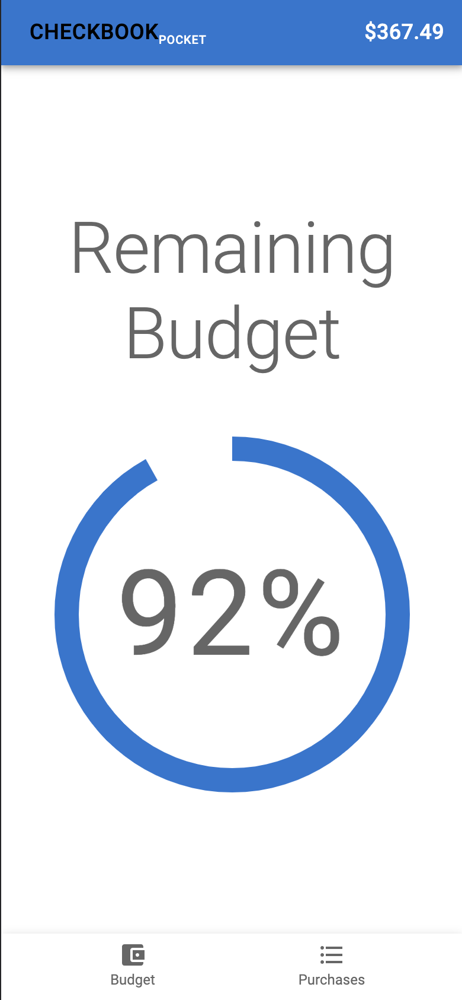
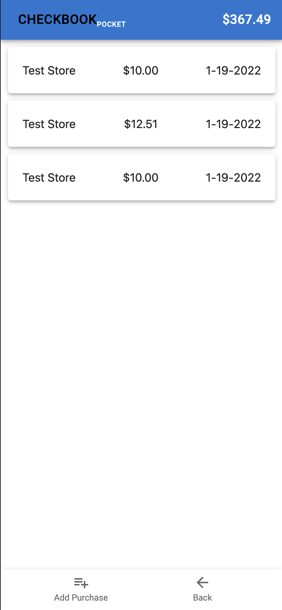
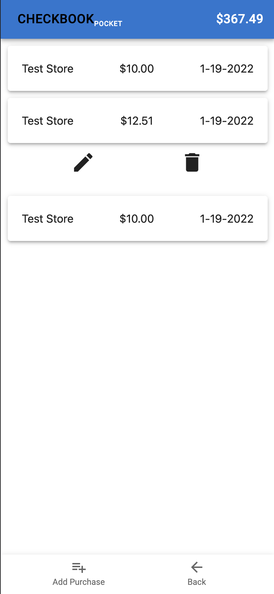
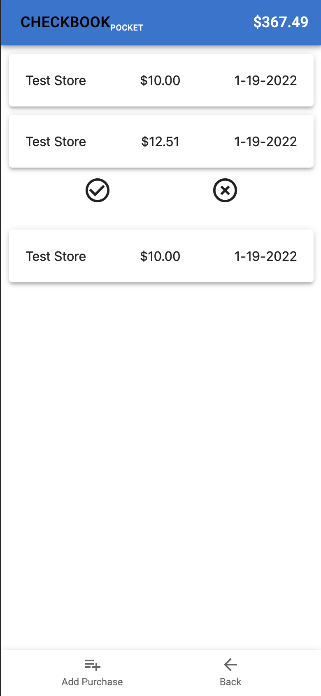

# Checkbook Pocket

### Budget app for tracking personal or family purchases. 

## Features
- User login/log out
- User login data caching 
- Remaining budget display in top nav
- "Remaining Budget" home screen visual as a percentage 
- Budget section for viewing current budget and remaining balance + setting new budget
- Purchase tracking for viewing, adding, editing, or deleting purchases
- Budget updates as purchases are added
- UI built utilizing Material-UI components
- Flexible interface for desktop or mobile usage

## Screenshots

